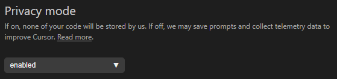

| Feature            | VS 2022 | CoPilot | Cursor | RooCode |
|--------------------|---------|---------|--------|---------|
| Rules              |   ⚠️    |   ✅    |   ✅   |   ✅   | 
| Docs Indexing      |   ❌    |   ❌    |   ✅   |   ❌   |
| Codebase Indexing  |   ❌    |   ❌    |   ✅   |   ❌   |
| MCP                |   ❌    |   ✅    |   ✅   |   ✅   |
| Debug              |   ✅    |   ✅    |   💩   |   ✅   |
| Web search         |   ✅    |   ✅    |   ✅   |   ⚠️   |  (⚠️ = Saknas OOB, men MCP löser det)
| Custom Modes       |   ❌    |   ❌    |   ⚠️   |   ✅   |  (⚠️ = Autoswitching saknas samt regler mappade till mode)
| Task Break Outs    |   ❌    |   ❌    |   ❌   |   ✅   |

## CoPilot har dock:
- [CoPilot Code Generation Instructions](CoPilot_rules/.copilot-codeGeneration-instructions.md)
- [CoPilot Commit Message Instructions](CoPilot_rules/.copilot-commit-message-instructions.md)
- [CoPilot Review Instructions](CoPilot_rules/.copilot-review-instructions.md)
- [CoPilot Test Instructions](CoPilot_rules/.copilot-test-instructions.md)
- chat.promptFiles

## Links
- [Cursor Documentation Index](https://raw.githubusercontent.com/getcursor/crawler/main/docs.jsonl)
- [Model Context Protocol (MCP) Introduction](https://modelcontextprotocol.io/introduction)

Remeber:
