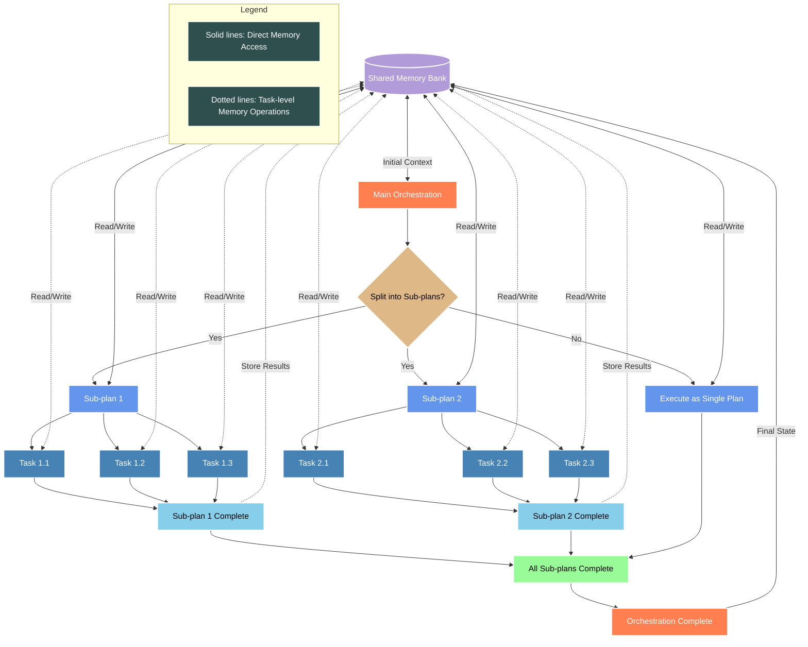

```mermaid
flowchart TD
    %% Main Memory Bank
    MB[(Shared Memory Bank)]
    
    A[Main Orchestration] --> B{Split into Sub-plans?}
    B -->|Yes| C[Sub-plan 1]
    B -->|Yes| D[Sub-plan 2]
    B -->|No| F[Execute as Single Plan]
    
    %% Sub-plan 1 tasks
    C --> G[Task 1.1]
    C --> H[Task 1.2]
    C --> I[Task 1.3]
    
    %% Sub-plan 2 tasks
    D --> J[Task 2.1]
    D --> K[Task 2.2]
    D --> L[Task 2.3]
    
    %% Task completions
    G & H & I --> P[Sub-plan 1 Complete]
    J & K & L --> Q[Sub-plan 2 Complete]
    
    %% Final completion
    P & Q --> S[All Sub-plans Complete]
    F --> S
    S --> T[Orchestration Complete]

    %% Memory interactions
    MB <-->|Initial Context| A
    MB <-->|Read/Write| C
    MB <-->|Read/Write| D
    MB <-->|Read/Write| F
    
    %% Task memory interactions
    MB <-.->|Read/Write| G
    MB <-.->|Read/Write| H
    MB <-.->|Read/Write| I
    MB <-.->|Read/Write| J
    MB <-.->|Read/Write| K
    MB <-.->|Read/Write| L

    %% Completion data storage
    P -.->|Store Results| MB
    Q -.->|Store Results| MB
    T -->|Final State| MB

    %% Styles for dark mode
    style A fill:#FF7F50,stroke:#fff,stroke-width:2px,color:#fff
    style B fill:#DEB887,stroke:#fff,stroke-width:2px,color:#000
    style S fill:#98FB98,stroke:#fff,stroke-width:2px,color:#000
    style T fill:#FF7F50,stroke:#fff,stroke-width:2px,color:#fff
    style MB fill:#B19CD9,stroke:#fff,stroke-width:2px,color:#fff
    
    %% Task styles
    style G fill:#4682B4,stroke:#fff,stroke-width:1px,color:#fff
    style H fill:#4682B4,stroke:#fff,stroke-width:1px,color:#fff
    style I fill:#4682B4,stroke:#fff,stroke-width:1px,color:#fff
    style J fill:#4682B4,stroke:#fff,stroke-width:1px,color:#fff
    style K fill:#4682B4,stroke:#fff,stroke-width:1px,color:#fff
    style L fill:#4682B4,stroke:#fff,stroke-width:1px,color:#fff
    
    %% Plan styles
    style C fill:#6495ED,stroke:#fff,stroke-width:2px,color:#fff
    style D fill:#6495ED,stroke:#fff,stroke-width:2px,color:#fff
    style F fill:#6495ED,stroke:#fff,stroke-width:2px,color:#fff
    
    %% Completion styles
    style P fill:#87CEEB,stroke:#fff,stroke-width:2px,color:#000
    style Q fill:#87CEEB,stroke:#fff,stroke-width:2px,color:#000
    
    %% Subgraph for memory legend
    subgraph Legend
        L1[Solid lines: Direct Memory Access]:::legend
        L2[Dotted lines: Task-level Memory Operations]:::legend
    end
    
    classDef legend fill:#2F4F4F,stroke:#fff,stroke-width:1px,color:#fff
``` 