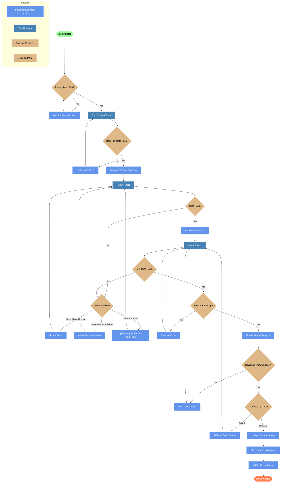

```mermaid
flowchart TD
    %% Initial State
    Start([Task Initiated]) --> A{Prerequisites Met?}
    A -->|No| B[Wait for Dependencies]
    B --> A
    
    %% Initial Stability Check
    A -->|Yes| C[Run Existing Tests]
    C --> D{Baseline Tests Pass?}
    D -->|No| E[Fix Existing Tests]
    E --> C
    
    %% Implementation First
    D -->|Yes| F[Implement Code Changes]
    F --> G[Run All Tests]
    G --> H{Tests Pass?}
    
    %% Analysis and Adjustment Phase
    H -->|No| I{Analyze Failure}
    I -->|Tests Need Update| J[Update Tests]
    I -->|Implementation Issue| K[Adjust Implementation]
    I -->|Both Required| L[Update Implementation and Tests]
    J --> G
    K --> G
    L --> G
    
    %% Add/Enhance Tests
    H -->|Yes| M[Add/Enhance Tests]
    M --> N[Run All Tests]
    N --> O{New Tests Pass?}
    O -->|No| I
    
    %% Refactor Phase
    O -->|Yes| P{Need Refactoring?}
    P -->|Yes| Q[Refactor Code]
    Q --> N
    
    %% Code Coverage Analysis
    P -->|No| R[Run Coverage Analysis]
    R --> S{Coverage Threshold Met?}
    S -->|No| T[Add Missing Tests]
    T --> N
    
    %% Code Quality Gates
    S -->|Yes| U{Code Quality Check}
    U -->|Failed| V[Address Code Smells]
    V --> N
    
    %% Completion
    U -->|Passed| W[Update Documentation]
    W --> X[Store Results in Memory]
    X --> Y[Mark Task Complete]
    Y --> End([Task Finalized])

    %% Styles for dark mode
    style Start fill:#98FB98,stroke:#fff,stroke-width:2px,color:#000
    style End fill:#FF7F50,stroke:#fff,stroke-width:2px,color:#fff
    
    %% Implementation and Test styles
    style C fill:#4682B4,stroke:#fff,stroke-width:2px,color:#fff
    style F fill:#6495ED,stroke:#fff,stroke-width:2px,color:#fff
    style G fill:#4682B4,stroke:#fff,stroke-width:2px,color:#fff
    style J fill:#6495ED,stroke:#fff,stroke-width:2px,color:#fff
    style K fill:#6495ED,stroke:#fff,stroke-width:2px,color:#fff
    style L fill:#6495ED,stroke:#fff,stroke-width:2px,color:#fff
    style M fill:#6495ED,stroke:#fff,stroke-width:2px,color:#fff
    style N fill:#4682B4,stroke:#fff,stroke-width:2px,color:#fff
    
    %% Analysis point style
    style I fill:#DEB887,stroke:#fff,stroke-width:2px,color:#000,stroke-dasharray: 5 5
    
    %% Decision points
    style A fill:#DEB887,stroke:#fff,stroke-width:2px,color:#000
    style D fill:#DEB887,stroke:#fff,stroke-width:2px,color:#000
    style H fill:#DEB887,stroke:#fff,stroke-width:2px,color:#000
    style O fill:#DEB887,stroke:#fff,stroke-width:2px,color:#000
    style P fill:#DEB887,stroke:#fff,stroke-width:2px,color:#000
    style S fill:#DEB887,stroke:#fff,stroke-width:2px,color:#000
    style U fill:#DEB887,stroke:#fff,stroke-width:2px,color:#000
    
    %% Process styles
    style B fill:#6495ED,stroke:#fff,stroke-width:2px,color:#fff
    style E fill:#6495ED,stroke:#fff,stroke-width:2px,color:#fff
    style Q fill:#6495ED,stroke:#fff,stroke-width:2px,color:#fff
    style R fill:#6495ED,stroke:#fff,stroke-width:2px,color:#fff
    style T fill:#6495ED,stroke:#fff,stroke-width:2px,color:#fff
    style V fill:#6495ED,stroke:#fff,stroke-width:2px,color:#fff
    style W fill:#6495ED,stroke:#fff,stroke-width:2px,color:#fff
    style X fill:#6495ED,stroke:#fff,stroke-width:2px,color:#fff
    style Y fill:#6495ED,stroke:#fff,stroke-width:2px,color:#fff
    
    %% State Legend
    subgraph Legend
        L1[Implementation/Test Updates]:::running
        L2[Test Running]:::success
        L3[Analysis Required]:::analysis
        L4[Decision Point]:::decision
    end
    
    classDef running fill:#6495ED,stroke:#fff,stroke-width:2px,color:#fff
    classDef success fill:#4682B4,stroke:#fff,stroke-width:2px,color:#fff
    classDef analysis fill:#DEB887,stroke:#fff,stroke-width:2px,color:#000,stroke-dasharray: 5 5
    classDef decision fill:#DEB887,stroke:#fff,stroke-width:2px,color:#000
``` 